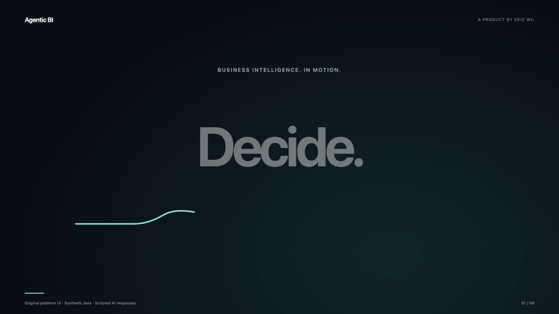

# Eric Wu
### Data & AI leadership · Business intelligence · Commercial transformation

I turn business intelligence into business action.

I lead data & AI strategy, investment and delivery for Consumer Health China at Bayer. My 12+ years across engineering, analytics and commercial roles connect business priorities with hands-on technical execution.

**[Explore my portfolio →](https://ericwu021.github.io)**

## Featured work — Agentic BI Platform

An enterprise BI & AI platform connecting **commercial visibility, investment decisions, digital operations and frontline execution** on a governed data foundation.

*Captured from an isolated copy of the actual platform code, using fictional brands, people, stores and figures. Original report components; no production connections. Source code remains private.*

**[Explore the actual platform screens and video tour →](https://ericwu021.github.io/#case)**

### Across the business

| Capability | Business decision it supports |
| --- | --- |
| **Product monitoring** | Track product and brand performance across channels. |
| **Financial steering** | Compare commercial costs, sales and cost ratios to guide investment. |
| **Digital advertising & O2O** | Steer Meituan in-site search, recommendation and promotion activity. |
| **Drug traceability** | Understand product flows through shipment, store delivery, offtake and hospital purchases. |
| **Omnichannel market insights** | Compare market and channel trends to inform business priorities. |
| **Daily store replenishment** | Prioritize store opportunities, assign plans and review execution. |
| **MCP tools & AI access** | Give authorized AI assistants access to business data and shared metrics, governed by permissions. |

The showcase presents **ten original interface views**, including O2O AI analysis, execution logs and execution-plan AI review, plus a 48-second product film with animated scenes, original music and real interface interactions. All displayed data is synthetic; AI responses are scripted demonstrations.

My contribution spans the roadmap, investment, delivery and adoption of a platform connecting analytics with daily business execution. Its design brings shared metric definitions, identity and access controls into the same environment as AI-assisted decisions.

## What I bring

| Leadership focus | How I put it into practice |
| --- | --- |
| Data & AI strategy | Connect investment and delivery priorities to commercial decisions. |
| Governance | Establish shared definitions and governed access for analytics and AI. |
| Applied AI | Embed contextual assistance and tool-assisted analysis into business workflows. |
| Transformation | Connect insight to execution plans, ownership and review. |
| Technical depth | Work hands-on with TypeScript, Next.js, SQL, Azure and AI tools. |

## My path

- **2024–present:** Sr. Commercial AI Platform Manager, Bayer Consumer Health China.
- **2019–2024:** Data insights, project management and commercial roles, Bayer Consumer Health China.
- **2014–2019:** Process Control and MES Engineer, Bayer Technology & Engineering Services.
- **Research:** PhD candidate in Electronics & Information at East China University of Science and Technology, studying governance of AI-driven business intelligence.

---
Personal portfolio. Descriptions reflect my work and perspective.
